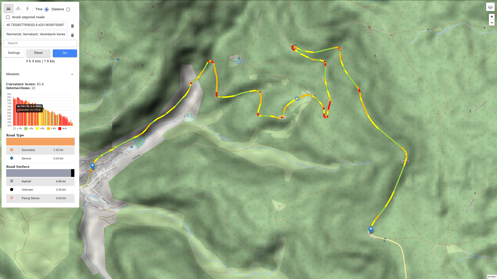

    </img>

# Maps

Discover steep & curvy roads for your next bike/motorbike/car trip.

## Features

- Elevation profile of route including grade
- Hovering over the elevation profile shows corresponding point on the route
- Amount of intersections on the route (less intersections means less unexpected vehicles on the road)
- Highlighting of the curvy parts of the route including score for overall curviness
- Overview of road types and road surfaces on the route
- Different map layers (topology/satellite/plain)
- Option to avoid unpaved roads during route calculation
- Import/export of routes
- List of all selected stops and the option for removal
- Markers show the name & coordinates of the location on click

## Usage

1. Select transportation (car/bike/walk)
2. Select shortest path by travel time or travel distance
3. Set (at least 2) stops via the search box or by left-clicking on map
4. Click "Go"
5. If a new route should be computed, click "Reset" or right-click on the map to reset

## Build

Dependencies:
- [Rust + Cargo](https://rustup.rs/)
- [Node.js + NPM](https://nodejs.org/de/download/package-manager/)

### Ubuntu 19.10
Run the bash script in the project root via `sudo ./build.sh`.
This also installs the necessary dependencies.

### Other
Run `make` in project root.

## Run

1. Download the *.osm.pbf file for your region e.g. from [Geofabrik](https://download.geofabrik.de/)
2. Run the executable in the project root and provide a *.osm.pbf file as argument, e.g. via `./maps germany-latest.osm.pbf`
3. Open [http://localhost:8000/](http://localhost:8000/) in the browser.

The first run will download the needed SRTM files, parse the provided *.osm.pbf file and save the result as binary.
Subsequent runs will only load the precomputed binary.
